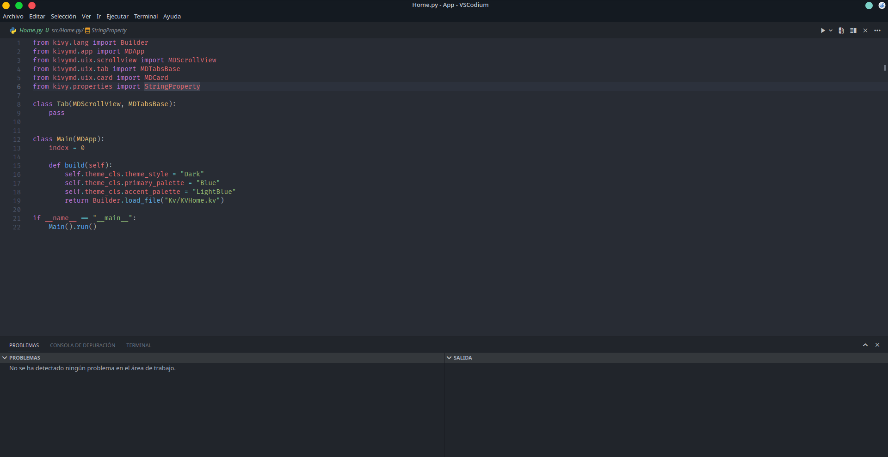

# SettingVSC

My personal setup for vsc, this setup will make your visual studio code look beautiful, this is a visual setup, and probably in the future, a setup for keyboard methods.

### Preview

### Prerequisites

Install the following extensions for vsc
Default extensions that we needed:

1. Material icon Theme for icons
2. Prettier
3. Indenticator
4. Yoru for general theme

for extra install Fira Code Font

### Installation

1. Copy the code from Settings.json on github
2. Go to Vsc configuration: 
3. Paste into Settings.json on VSC

#### Notes
This environment is configured for Windows, if you want to configure it in linux please note that the "Yoru" theme is not available in Code OSS or VSCodium
